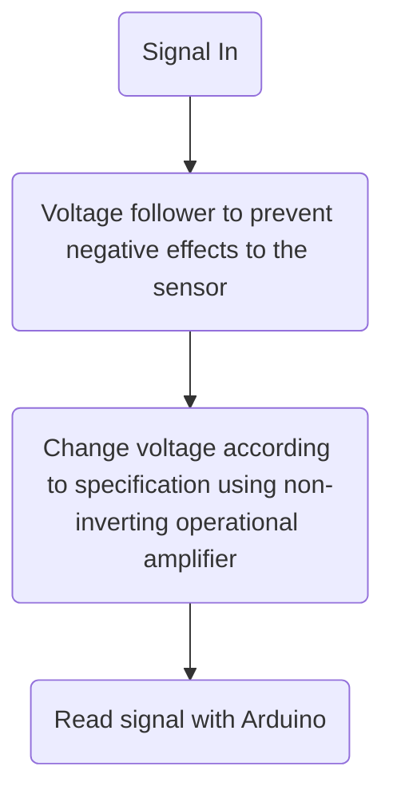

# Iot-weather_station
 

Block diagram for handling analog temperature signal.

```mermaid
flowchart TD
    A(Signal In) --> B(Voltage follower to prevent negative effects to the sensor)
    B --> C(Change voltage according to specification using non-inverting operational amplifier)
    C --> D(Read signal with Arduino)
```
